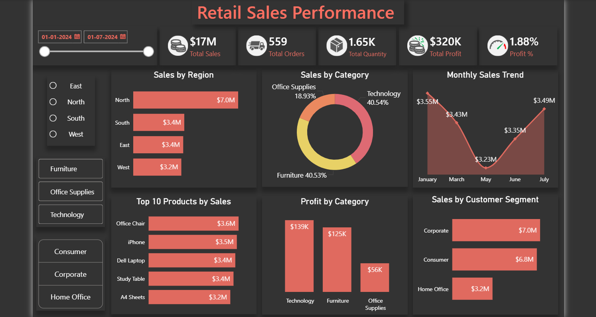

# 📊 Retail Sales Analysis Dashboard (Power BI)

## 📌 Project Overview

This project presents an interactive Power BI dashboard analyzing retail sales data to uncover business insights related to revenue, profit, and customer trends.

---

## 🎯 Objectives

* Analyze sales performance across regions
* Identify top-performing products
* Track revenue and profit trends
* Enable data-driven business decisions

---

## 🛠 Tools & Technologies

* Power BI
* Excel
* DAX (Data Analysis Expressions)

---

## 📊 Dashboard Features

* KPI cards for Total Sales, Profit, and Orders
* Region-wise sales analysis
* Product category performance
* Time-based sales trends
* Interactive filters and slicers

---

## 📷 Dashboard Preview



---

## 📈 Key Insights

* Identified top-performing regions contributing highest revenue
* Highlighted low-performing categories requiring improvement
* Observed seasonal trends in sales performance
* Improved decision-making using visual insights

---

## 📁 Project Structure

```text
Retail-Sales-Analysis-PowerBI/
│
├── dashboard/
│   └── retail_sales.pbix
├── data/
│   └── sales_data.xlsx
├── images/
│   └── dashboard.png
├── README.md
```

---

## 🚀 Outcome

This project demonstrates:

* Business intelligence and reporting skills
* Dashboard development in Power BI
* Data-driven decision-making
* KPI tracking and visualization

---

## 🔮 Future Improvements

* Add forecasting models
* Integrate real-time data
* Deploy dashboard online

---

## 👨‍💻 Author

**Irfan Shaik**
Aspiring Data Analyst

🔗 LinkedIn: [www.linkedin.com/in/shaik-irfan2003](http://www.linkedin.com/in/shaik-irfan2003)
🔗 GitHub: https://github.com/Irfan78693

⭐ If you found this project useful, please give it a star.
